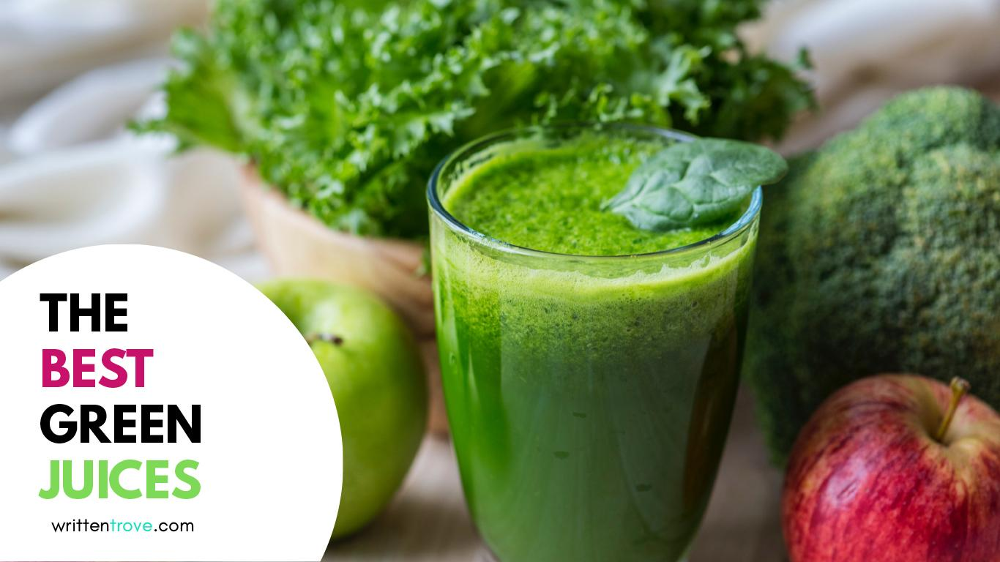

“It’s green so it must be healthy, right?” This was exactly what went through my mind when the green juice trend went mainstream and somewhat became a must-have accessory for health-conscious consumers.

Well the fact is, not all green juices are as “healthy” as you think. There are healthier alternatives such as smoothies and green juice superfood powders but most of us just crave a cool, refreshing, hyrdating drink to grab while on the go.

## Healthiest Store-Bought Green Juices

**What to Avoid: Sugar**

Sugar is something you should avoid in general when you are health-conscious and store-bought green juices are no exception to this.

An example would be Naked Juice: Green Machine with the label “zero added sugar”. However, a look at the label reveals that there are 53 grams of sugar—and 270 calories—in one 15-ounce bottle. That’s a lot considering a Coke contains 49 grams of sugar.

**&#8220;But, the sugar comes from fruits, right?&#8221;**

True. But did you know that most of these store-bought juices contain little to no fiber at all?

Without the dietary fiber to slow down the release of sugar into your bloodstream and keep your blood sugar stable, downing these green juices would only be a way to take in a lot of sugar and calories.

Here are some of the healthier options:

<a  href="http://www.jambajuice.com/campaigns/250-calorie/great-greens"   target="_blank"  rel="noopener noreferrer">

<h4>
  1. Jamba Juice: Great Greens
</h4>

  </a>  <a href="http://www.jambajuice.com/campaigns/250-calorie/great-greens" data-elementor-open-lightbox="" target="_blank" rel="noopener noreferrer">   </a>

  When it comes to juicing, you’d probably think of Jamba Juice. They’re one of the more well-known juicing brands internationally. Of course, we need to look at the nutritional information, not just the brand.

  This smoothie (12 oz.) contains a blend of apples, cucumbers, lemons, and chia seeds – along with your super greens, spinach and kale. It’s low sugar (17g), low sodium (30g), and comes with 2g of fiber and 3g of protein to guarantee you get the most nutrients for the lowest sugar possible.

  <a  href="https://www.evolutionfresh.com/juice/green-devotion/"   target="_blank"  rel="noopener noreferrer">
 
  
  <h4>
    2. Evolution Fresh: Green Devotion
  </h4>
  
  

    </a>  <a href="https://www.evolutionfresh.com/juice/green-devotion/" data-elementor-open-lightbox="" target="_blank" rel="noopener noreferrer">   </a>
  

  
  

    You might have seen their juices when lining up on Starbucks. Among the Evolution Fresh juices on the counter, this one has the lowest amount of sugar &#8211; just 5 grams in an 11oz. bottle. It’s made from celery, cucumber, spinach, romaine juices, and kale, and is finished with lemon and parsley, providing tons of vitamin K and potassium. Aside from a little high amount of sodium (300 mg), you get only 35 calories plus 1 gram of fiber and 3 grams of protein.
  

  
  

    <a  href="https://www.evolutionfresh.com/juice/emerald-greens/"   target="_blank"  rel="noopener noreferrer">
 
    
    <h4>
      3. Evolution Fresh: Organic Emerald Greens
    </h4>
    
    

      </a>  <a href="https://www.evolutionfresh.com/juice/emerald-greens/" data-elementor-open-lightbox="" target="_blank" rel="noopener noreferrer">   </a>
    

    
    

      Opt for this one instead if you want something sweeter (14g of sugar) but lower sodium (90mg). An 11oz bottle contains lime, lemon, kale, apple, cucumber, spinach, and romaine juices.
    

    
    

      <a  href="https://www.sujajuice.com/products/suja-classic/twelve-essentials/"   target="_blank"  rel="noopener noreferrer">
 
      
      <h4>
        4. Suja Juice: 12 Essentials
      </h4>
      
      

        </a>  <a href="https://www.sujajuice.com/products/suja-classic/twelve-essentials/" data-elementor-open-lightbox="" target="_blank" rel="noopener noreferrer">   </a>
      

      
      

        If you are really committed to your health, you should consider getting this one as it is loaded with veggies and is not sweetened with fruit. Instead of fruit juices to add sweetness, they use spearmint tea and peppermint tea to cut the bitterness. For a 16-ounce bottle, you get 4 grams of sugar, 115mg of sodium plus 2 grams of protein.
      

      
      

        <a  href="https://www.sujajuice.com/products/suja-classic/glow/"   target="_blank"  rel="noopener noreferrer">
 
        
        <h4>
          5. Suja Juice: Glow
        </h4>
        
        

          </a>  <a href="https://www.sujajuice.com/products/suja-classic/glow/" data-elementor-open-lightbox="" target="_blank" rel="noopener noreferrer">   </a>
        

        
        

          If you want something sweeter (14g of sugar) than 12 essentials but has lower sodium (85mg), try this one instead. A 16-ounce bottle contains apple, celery, cucumber, kale, collard greens, peppermint tea, spearmint tea and spinach.
        

        
        

          <a  href="https://blueprint.com/kale-it-up-6pk/BPR+84020001-1S.html?cgid=16oz-juices&openedfrom=Category"   target="_blank"  rel="noopener noreferrer">
 
          
          <h4>
            6. BluePrint: Kale it Up
          </h4>
          
          

            </a>  <a href="https://blueprint.com/kale-it-up-6pk/BPR+84020001-1S.html?cgid=16oz-juices&openedfrom=Category" data-elementor-open-lightbox="" target="_blank" rel="noopener noreferrer">   </a>
          

          
          

            Want <b>100%</b> of your daily recommended amount of Vitamin A? This one contains 910 mcg of Vitamin A, 25g of sugar, 6g of fiber, and 3g of protein made from apple juice, romaine juice, celery, cucumber, lemon, kale, spinach, parsley juice, and organic ginger juice.
          

          
          

            <strong>* Recommended intakes for vitamin A for people aged 14 years and older range between 700 and 900 micrograms</strong>
          

          
          

            <a  href="https://blueprint.com/watercress-warrior-6pk/BPR+84020024-1S.html?cgid=16oz-juices&openedfrom=Category"   target="_blank"  rel="noopener noreferrer">
 
            
            <h4>
              7. BluePrint: Watercress Warrior
            </h4>
            
            

              </a>  <a href="https://blueprint.com/watercress-warrior-6pk/BPR+84020024-1S.html?cgid=16oz-juices&openedfrom=Category" data-elementor-open-lightbox="" target="_blank" rel="noopener noreferrer">   </a>
            

            
            

              Want <strong>120%</strong> of your daily recommended amount of Vitamin C? This one on the other hand contains 107 mg of Vitamin C, 4g of sugar, 3g of fiber, and 4g of protein made from cucumber, water (74% juice), kale, celery, lemon, spinach juice, organic watercress juice, and natural peppermint flavour.
            

            
            

              <strong>* Recommended daily amount for vitamin C is 65 to 90 milligrams (mg) a day</strong>
            

            
            

              <a  href="https://drinkdailygreens.com/green-juices"   target="_blank"  rel="noopener noreferrer">
 
              
              <h4>
                8. Daily Greens: Purity
              </h4>
              
              

                </a>
              

              
              

                A 12 oz. bottle containing 9 grams of sugar and 180 grams of sodium. Ingredients include kale, cucumber, parsley, broccoli, celery, lemon, and basil.
              

