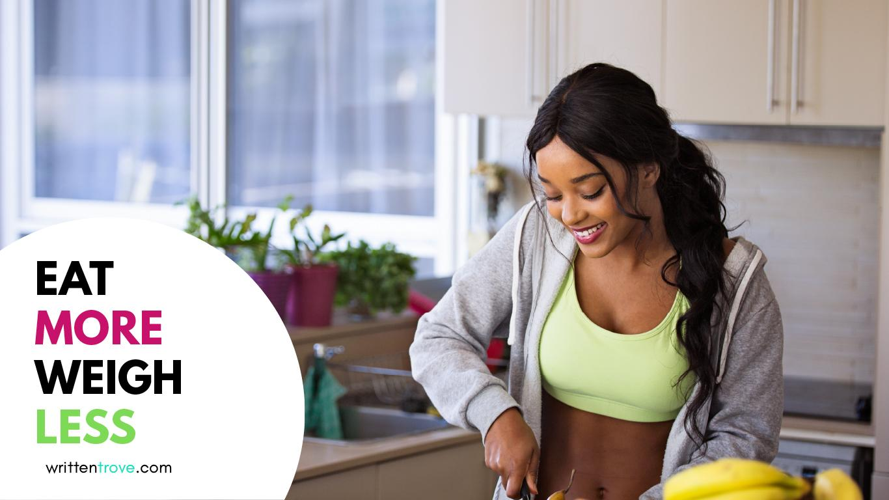

To eat without worrying about any consequence, that’s the dream, right? You can’t help but wonder why some people can just eat to their heart’s content but just don’t seem to get fat. Well, that’s the reality. Research shows that some people are more genetically predisposed to obesity.

### But did you know?

Contrary to popular belief, instances where obesity is caused solely by genetics alone are **rare**. You see the excuse usually is “It’s in my genes – nothing I can do about it.” Few people realize that you can actually take control of your weight with several small lifestyle changes.

A <a href="http://www.hsph.harvard.edu/obesity-prevention-source/obesity-causes/genes-and-obesity/" target="_blank" rel="noopener noreferrer">research from HSPC</a> assures us that when it comes to obesity, it’s rare for your weight density to be determined by your heredity. It’s more likely to be determined by factors such as your diet, lifestyle, and environment.

### The bottom line is:

**Whether you’re genetically predisposed to obesity or not, w\*\***e all gain weight the same way\*\*.&nbsp; Sure some people gain weight faster than others but again, this can be countered with small changes to your diet and lifestyle.

You see, obesity occurs when the calories you eat exceed the calories your body needs to use. As your body doesn’t need leftover calories, it stores them as fat. Note that by the time your body accumulates 3,500 leftover calories, you’ll have deposited one pound of fat.

### So what&#8217;s the formula to eating more but weighing less?

Now that you know how someone gains weight, the formula becomes simple, doesn’t it?

The secret to success is finding a way to eat **fewer calories** instead of eating **less food.** It’s a fail-safe formula if you think about it.\*\*\*\*

\*\*

---

### But that sounds like a contradiction. Eat fewer calories instead of eating less food?

You see, modern food technology has turned inexpensive, low-calorie, high-volume foods into pricey, high-calorie, unfulfilling meals. It’s like eating a whole meal’s worth of calories with only a few bites of food!

How? Let me give you some examples:

- Technology takes 14 ears of corn and extracts **one tablespoon** of corn oil. With just one gulp of that corn oil, you’re taking in 110 calories. If you ate a large ear of boiled, yellow corn, you’d have finished it feeling full while taking in the same amount of calories.
- Take seven pounds of sugar beets, strip them of their bulk, fiber, and nutrients to produce **one pound of sugar**. Note that 100 grams of sugar = 387 calories. Sugar and other refined sweeteners now account for more than 20 % of daily calories eaten.
- Grains, robbed of fiber and nutrients, can be turned into alcohol, accounting for another 9% of empty calories many of us consume every day.

You get the picture. With modern diets consisting of processed and concentrated calories like these, no wonder we gain weight.

## So, how do I go about eating fewer calories?

**Eat more:**

- Whatever your diet may be, you should focus on getting whole grains such as brown rice, millet, barley, corn, wheat, and rye. Whole-grain products such as cooked cereals, tortillas, breads and pasta are also recommended.
- Tubers and legumes &#8211; these are sweet potatoes, potatoes, yams, taro and all kinds of beans, lentils, and peas.
- Fresh and steamed vegetables – don’t go overboard on sauces and salad dressings.
- Fresh, whole fruits – preferably locally grown ones. Avoid canned fruits in syrup and fiber-poor fruit juices.

**Eat less:**

- Refined, processed, and concentrated foods. We’re looking at your fast-food takeouts. They are high in both price and calories but low in nutrients and fiber. Not worth it.
- Nuts, meats and rich dairy products. Out of the six nutrients, carbohydrates, protein and fat provide calories. These foods may be nutritious but they are very high in fat thus making it high in calories.

**Anything else?**

**Attitude tips:**

Focus on eating more of the hundreds of foods that you **should** eat, not on those you shouldn’t. It takes time to adapt to a new way of eating. Be patient.

Losing weight doesn&#8217;t mean you should go into &#8220;semi-starvation&#8221; mode. Dieting should be fun and semi-starvation diets only leave you feeling dissatisfied, frustrated, and craving for more to eat &#8211; which doesn&#8217;t help when we&#8217;re fighting the main problem: **overindulgence** and **overeating.**

By choosing the right kinds of foods, you can eat more and still lose one to two pounds a week.&nbsp;

Cheers!
