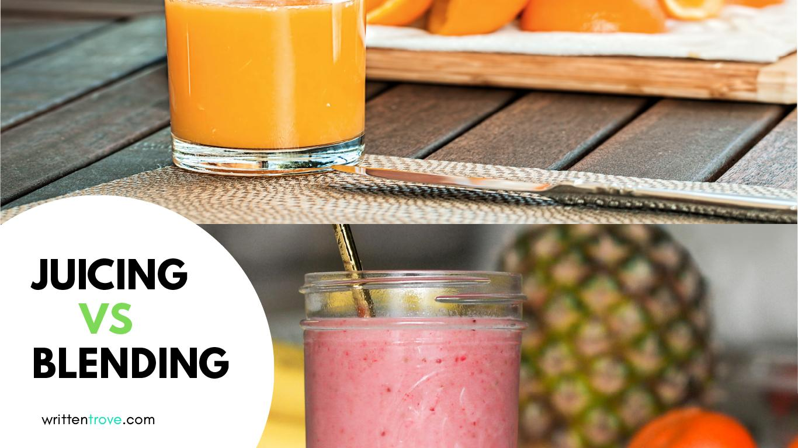

When it comes to this subject, people really like to take sides whether which one is healthier. If I was you, I&#8217;d rather worry about which one costs more.&nbsp;😅

## A juice is:

when you extract the liquid from fruits and vegetables, **minus the pulp**.

## &#8220;Isn’t it a waste to throw away the pulp? I don’t get why you’d throw away all that fiber.&#8221;

The common belief is that when you discard the pulp, you throw away **all** of the dietary fiber. That is not true.

First of all there are **two types of dietary fiber**: insoluble and soluble fiber. Both of them have health benefits. They keep the digestive tract healthy by slowing down digestion and absorption of nutrients.

**Insoluble fiber**

**The pulp that you throw away is mostly made up of insoluble fiber.**

- Insoluble fiber doesn’t absorb water (think of when you soak a cabbage in water) and remains unchanged as it moves through the digestive tract. It **cannot be digested**.
- This is found in the seeds and skin (peel) of fruits, whole wheat grains found in wheat bread and brown rice.
- You should at least know the **main** **health benefits** of what you’re throwing away. According to <a style="color: #028dd4;" href="https://www.webmd.com/diet/features/insoluble-soluble-fiber" target="_blank" rel="noopener noreferrer">WebMD</a> and <a style="color: #028dd4;" href="https://www.medicalnewstoday.com/articles/319176.php" target="_blank" rel="noopener noreferrer">MedicalNewsToday</a> , it helps when you’re constipated/prevents constipation and helps reduce the risk of haemorrhoids.

**Soluble fiber**

**A third or more of this fiber is in the juice itself.**

- Soluble fiber absorbs water (like when you add water to an oat) and transforms into a gel-like substance. This **can be digested** by bacteria in the colon.
- Common juicing ingredients such as apple, spinach, pineapple, kale, and carrots have high soluble fiber.
- The **main health benefits** of soluble fiber are lowering fat absorption, **stabilizing blood sugar levels,** and lowering cholesterol. It also helps when you have **diarrhea**.

The fact that the pulp has been removed doesn’t make juices undrinkable. Since the insoluble fiber has been discarded, **this allows your body to absorb nutrients into the bloodstream in the quickest way possible** – which is the most important aspect of juicing.

## &#8221; But wouldn’t that mean that juices are also a way to take in a lot of sugar and calories?&#8221;

This argument is usually about fruit juices. The general consensus is that <a style="color: #028dd4;" href="https://dietifi.com/best-green-juices/">vegetable based juices (green juices)</a> are healthier than fruit juices and rightfully so.

What worries me is that people would go as far as to say that fruit juices are “unhealthy” because it’s high in sugar and removing the fiber causes you to absorb that sugar quickly.&nbsp;

We have to remember that soluble fibers including pectin, gums, and mucilage are still present in the juice and is responsible for stabilizing blood sugar.

A <a style="color: #028dd4;" href="https://www.ncbi.nlm.nih.gov/pmc/articles/PMC5736636/" target="_blank" rel="noopener noreferrer">new study published in the Journal of Nutritional Science</a> suggests that 100% fruit juice does not have a significant effect on fasting blood glucose (blood sugar level), fasting blood insulin, or insulin resistance. The findings are consistent with previous research indicating 100% fruit juice is not associated with increased risk of developing type 2 diabetes.

## A smoothie is:

When you blend a fruit or a vegetable or both **with the pulp intact** plus liquid (water or milk) into a puree**.** Unike juice, you get all the nutrients, plus the fiber. There really is nothing to concern yourself about smoothies except&nbsp; that some shops replace some ingredients with unhealthy options such as artificial almond milk, fruit powders, and even sweeteners.

## Conclusion

**Why and when would you juice?**

- Juice if you’re craving for a cool and refreshing drink.
- Juice if you’re thirsty rather than hungry.
- Juice if you need a quick energy boost.
- Juice if you want the fastest way to absorb nutrients.
- Instead of force feeding yourself when you’re recovering from an illness, you might find it easier to drink juices to provide the nutrients your body needs.

**Why and when would you blend a smoothie?**

- Blend if you’re running late. Compared to juicing, blending a smoothie literally takes less than a minute or two. All you need to do is throw in all your ingredients and push the right buttons.
- Blend if you crave for fruits and vegetables that produce little or are impossible to juice (like avocado and banana).
- Blend if you’d like to add ingredients like seeds and nuts.
- Blend if you feel hungry rather than thirsty. With smoothies, you get all of the nutrients plus both of the dietary fibers so you will feel fuller for longer hours.
